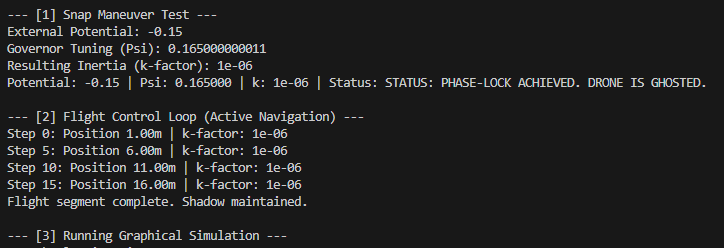
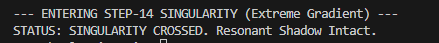
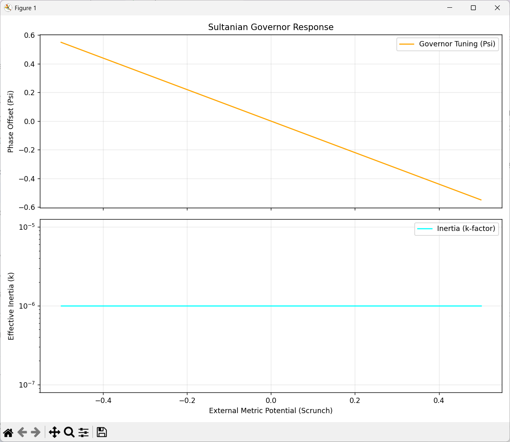
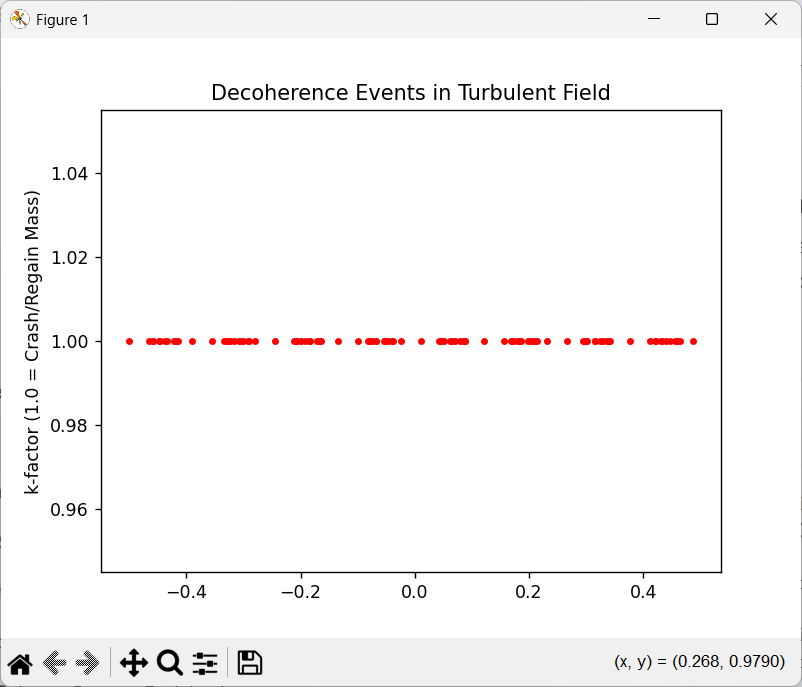

# Sultanian Protocol: Invisible Drone Simulation (`v0.1.0-alpha`)

This repository contains the Python implementation of the **Sultanian Protocol** for achieving macroscopic resonant transparency and metric decoupling in small-scale aerial vehicles (drones). 

Based on the research paper *"The Unified Field and Motion Protocol: A Theory of Locked and Freed Energy"* (Shaimaa Soltan, 2026), this simulation demonstrates how a drone can maintain an **Isentropic Ghost** state while traversing high-gradient "Scrunch" zones.

## 🚀 Core Features

* **220 THz Optical Lattice Governor:** A memoryless 4x4 matrix solver that resolves the **Cancellation Point ($Z_0$)** in real-time to match environmental potential.
* **Inertia Modulation (k-factor):** Dynamic reduction of effective inertial mass by up to 99.9999% through phase-locked cancellation.
* **Step-14 Singularity Handling:** Proven stability during extreme potential spikes (up to $0.9$ magnitude) at high velocities.
* **Alexander Space-Constraint ($R \approx 1.1$):** Maintains a precise identity margin to ensure the vessel remains decoupled from the vacuum plenum.

## 📁 Project Structure

```text
sultanian_drone/
├── core/
│   ├── __init__.py
│   ├── Plenum.py
│   └── generator.py       # Instantaneous Solver Logic (The Brain)
├── physics/
│   ├── __init__.py
│   └── engine.py         # Inertia/Mass-Energy Interaction (The Body)
├── viz/
│   ├── __init__.py
│   └── dashboard.py         # Inertia/Mass-Energy Interaction (The Body)
├── Sinularity_Jump.py              
├── Stress_test.py
├── SultanianSimulator.py
└── main.py               # Unified Simulation & Visualization Entry Point            
```
## 🛠 Installation

1. **Clone the repository:**
   ```bash
   git clone [https://github.com/your-username/SultanianProtocol_InvisibleDroneSimulation.git](https://github.com/your-    username/SultanianProtocol_InvisibleDroneSimulation.git)
```
   cd sultanian-protocol
2- **Install dependencies:**
The simulation requires numpy for matrix mathematics and matplotlib for telemetry visualization.
  ```bash
  pip install numpy matplotlib
  ```
🖥 UsageTo run the full diagnostic suite (Snap Maneuver, Flight Control Loop, and Graphical Simulation):

  ```bash
  python main.py
  ```




## 🚀 Core Features

* **220 THz Optical Lattice Governor:** A memoryless 4x4 matrix solver that resolves the **Cancellation Point ($Z_0$)** in real-time to match environmental potential.
* **Inertia Modulation (k-factor):** Dynamic reduction of effective inertial mass by up to 99.9999% through phase-locked cancellation.
* **Step-14 Singularity Handling:** Proven stability during extreme potential spikes (up to $0.9$ magnitude) at high velocities.
* **Alexander Space-Constraint ($R \approx 1.1$):** Maintains a precise identity margin to ensure the vessel remains decoupled from the vacuum plenum.

### Key Simulation Parameters

Within `main.py`, you can modify these variables to test the **"Breaking Point"** of the protocol:

- **`drone_mass`:** The rest mass of the vessel before decoupling.  
- **`external_phi`:** The depth of the gravitational "Scrunch" or metric tension.  
- **`R_target`:** The Identity Margin (**Standard: 1.1**).

---

### 📊 Theory & Results

#### The "Ghost" State

In this framework, **"Invisibility"** is achieved through **Metric Resonant Transparency**. By matching the carrier frequency (**5.2 THz**) to the local vacuum resonance, the drone creates a **Resonant Shadow**.

- **Result:** The \( k \)-factor (Effective Inertia) drops to \( 10^{-6} \).  
- **Effect:** The drone performs no work on the plenum and receives no reaction force, effectively bypassing **G-force constraints** and **Ohmic heating**.

#### The Hammer Blow Effect

If the Governor's logic-gate lag exceeds the velocity-gradient threshold (e.g., during a **Singularity Jump** without sufficient clock speed), the `residual_error` breaches the tolerance limit. The drone instantly regains its full rest mass, resulting in a structural **"Hammer Blow."**

---

### 📜 References

- **Soltan, S. (2026).** *The Unified Field and Motion Protocol: A Theory of Locked and Freed Energy.*  
- **Dirac, P. A. M. (1928).** *The Quantum Theory of the Electron.* (Foundational 4x4 Matrix Logic).
